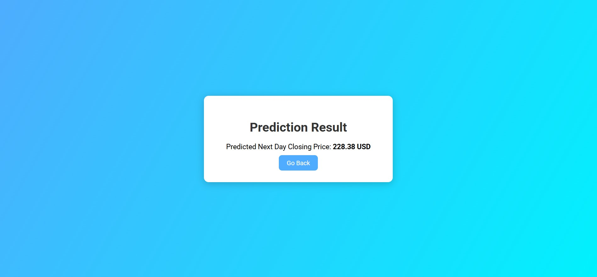

# Stock Price Predictor (LSTM + Flask)
  

## Overview
This project is a web-based stock price predictor using a Long Short-Term Memory (LSTM) neural network for time series forecasting.
The model predicts the next day's closing price based on the last 60 days of closing prices.

## Tech Stack
Python (Flask, TensorFlow, NumPy, Pandas, Scikit-learn)
HTML5 / CSS3 (Custom templates)
Joblib (for saving scalers)
Jupyter Notebook (for model training)

## Setup & Run
### Clone Repository
git clone https://github.com/sabnam813/Stock-price-Analysis.git
cd StockPredictor

### Install Dependencies
pip install -r requirements.txt

### Train Model 
Open train_model.ipynb in Jupyter Notebook and run all cells to train a new LSTM model.

### Run Flask App
python app.py
Visit http://127.0.0.1:5000 in your browser.

## How to Use
Enter last 60 closing prices (comma-separated) on the home page.
Click Predict.
Get the predicted next-day closing price.

## License
This project is licensed under the MIT License – you are free to use, modify, and distribute it with attribution.

